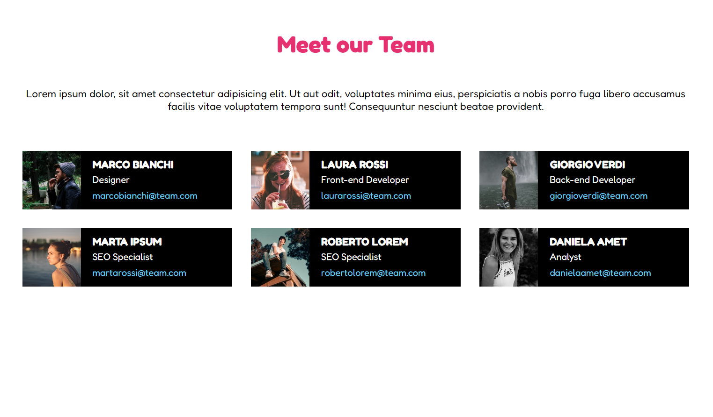

# Our team
## Traccia
Dato un array di oggetti rappresentante un team di un’azienda, creare una pagina dedicata in cui mostrare una card per ciascun componente.
(trovate l’array del team all’interno della cartella in allegato)

### Risultato finale

## Bonus
- Rendere l’esercizio responsive, mandando a capo le card
- Aggiungere un form di aggiunta membri che permetta di visualizzare il nuovo membro sulla pagina (usate una foto qualunque, anche vostra se volete sentirvi parte del team! :sorridere:)
Buon Lavoro

## Human coding
1. Strutturo il mio codice HTML in due parti:
    -Header: contenente la parte del titolo;
    -Main: suddiviso a suo volta in due parti:
        *Una parte descrittiva;
        *La sezione contenente le mie card;
2. Scrivo un'algoritmo che per ogni membro (oggetto) presente all'interno del mio array, mi generi una card apposita con al suo inteno tutti i dati     (valori) del membro del team.

